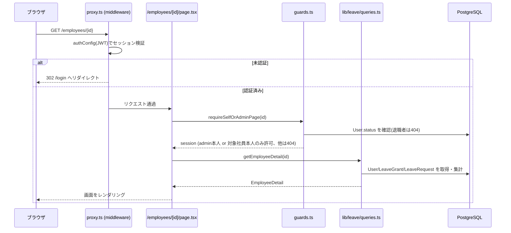

# アーキテクチャ設計書

## レイヤ構成

```
┌─────────────────────────────────────────────┐
│ src/proxy.ts (Next.js middleware)             │  ← 未認証リクエストの一次防御(全ルート横断)
├─────────────────────────────────────────────┤
│ src/app/**/page.tsx (Server Component)        │  ← 個別ページの二次防御(guards.ts) + 画面表示
│ src/app/**/actions.ts ("use server")          │  ← Server Action。個別に認可チェックを行う
├─────────────────────────────────────────────┤
│ src/lib/leave/*, src/lib/employees/*          │  ← 業務ロジック層(純粋関数 + Prisma読み書き)
│   - schedule.ts, balance.ts, request-rules.ts │     (純粋関数。DBアクセスなし、単体テスト容易)
│   - queries.ts, mutations.ts                  │     (Prismaを直接呼ぶ読み書き層)
├─────────────────────────────────────────────┤
│ src/lib/prisma.ts (PrismaClient singleton)    │  ← @prisma/adapter-pg 経由でPostgreSQLへ接続
└─────────────────────────────────────────────┘
```

ポイントは、`schedule.ts` / `balance.ts` / `request-rules.ts` が **DBに依存しない純粋関数** として切り出されている点である。付与日数計算・FEFO消化順・重複申請チェックといった業務ルールの正しさは、これらの関数の入出力だけでテストできる。`queries.ts` / `mutations.ts` はそれらの純粋関数を呼び出しつつ、Prisma でのデータ取得・永続化・トランザクション制御を担当する。

spec.md 8章が要求する「サーバーサイドで個別に認可する」という方針を反映し、`src/proxy.ts` によるルート単位の防御だけでなく、各 `page.tsx` の先頭と各 Server Action の先頭でも `src/lib/auth/guards.ts` の関数を呼んで認可チェックを行う(二重防御)。詳細は [04-authorization.md](04-authorization.md) を参照。

## ディレクトリ構成(主要部分)

```
employee-leave-app/
├─ prisma/
│  ├─ schema.prisma        # データモデル定義(→ 02-database.md)
│  └─ seed.ts               # シードデータ生成スクリプト
├─ src/
│  ├─ auth.config.ts        # edge-safe な NextAuth設定(providers空、Prisma/bcryptを含まない)
│  ├─ auth.ts               # フル版NextAuth設定(Credentials provider + Prisma)
│  ├─ proxy.ts              # Next.js 16 で middleware.ts から改称。ルート保護
│  ├─ lib/
│  │  ├─ auth/guards.ts     # ページ/Server Action共通の認可ガード
│  │  ├─ date/calendar.ts   # UTC日付演算のユーティリティ
│  │  ├─ decimal.ts         # Prisma Decimal ⇔ number 変換
│  │  ├─ leave/
│  │  │  ├─ schedule.ts     # 付与スケジュール(純粋関数)
│  │  │  ├─ balance.ts      # FEFO消化・残高計算(純粋関数)
│  │  │  ├─ request-rules.ts# 申請ルール(純粋関数)
│  │  │  ├─ queries.ts      # 読み取り(Prisma)
│  │  │  ├─ mutations.ts    # 書き込み(Prisma、トランザクション)
│  │  │  ├─ labels.ts       # enum→日本語表示ラベル
│  │  │  └─ errors.ts       # 業務エラークラス(DomainError系)
│  │  └─ employees/
│  │     ├─ queries.ts      # 社員情報の読み取り
│  │     └─ mutations.ts    # 社員の作成・更新・退職処理
│  └─ app/
│     ├─ login/page.tsx
│     └─ employees/
│        ├─ page.tsx                 # 社員一覧
│        ├─ employee-row.tsx
│        ├─ [id]/page.tsx            # 社員詳細/マイページ
│        ├─ [id]/actions.ts          # 申請/承認/却下/取消/取り下げ Server Actions
│        ├─ [id]/leave-request-form.tsx
│        ├─ [id]/request-action-buttons.tsx
│        ├─ [id]/edit/page.tsx       # 社員編集・退職処理
│        ├─ [id]/edit/actions.ts
│        ├─ [id]/edit/edit-employee-form.tsx
│        ├─ [id]/edit/terminate-section.tsx
│        ├─ new/page.tsx             # 社員新規登録
│        ├─ new/actions.ts
│        └─ new/new-employee-form.tsx
└─ doc/                      # このディレクトリ
```

## 認証まわりのファイル分割

NextAuth v5 の設定は意図的に2ファイルへ分割している。

- `src/auth.config.ts` — Prisma や bcrypt を import しない、Edge runtime でも動作可能な設定(`session.strategy: "jwt"`、`jwt`/`session` コールバックで role を JWT・セッションに伝搬)。`src/proxy.ts` はこちらを使う。
- `src/auth.ts` — `authConfig` を継承しつつ、`Credentials` provider(Prisma で `User` を検索し `bcrypt.compare` でパスワード照合)を追加したフル版。API ルート・Server Component・Server Action から使う。

これは Next.js の middleware(Edge runtime)から Prisma や bcrypt(Node.js API 依存)を直接使えない制約に対応するための構成であり、Auth.js が公式に推奨するパターンでもある。

## リクエストフロー(社員詳細ページの例)



## 補足

- `next.config.ts` / `tsconfig.json` は既定に近い設定であり、特筆すべきカスタマイズはない。
- Prisma 7 の新クライアントジェネレーターは `driverAdapters` を前提とするため、`src/lib/prisma.ts` は `pg` の `Pool` を `@prisma/adapter-pg` でラップして `PrismaClient` に渡す構成になっている(素の接続文字列だけでは動作しない)。
