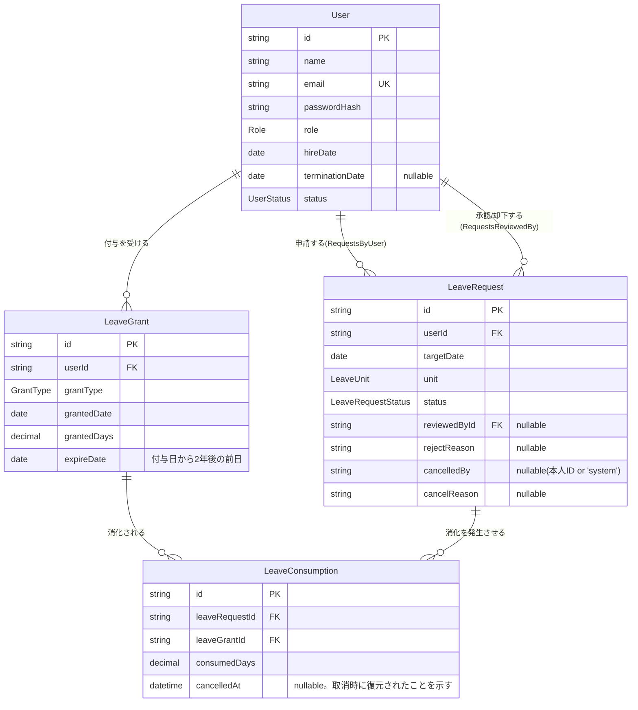

# データベース設計書

対応ファイル: `prisma/schema.prisma`(spec.md 7章「データモデル(概念設計)」に対応)。

## ER図

## テーブル定義

### `users`(User。spec.md 7.1)

| カラム(DB) | 型 | 説明 |
|---|---|---|
| id | text (cuid) | 主キー |
| name | text | 氏名 |
| email | text, unique | ログインID兼メールアドレス |
| password_hash | text | `bcryptjs` によるハッシュ(平文は保存しない) |
| role | enum Role | `admin` \| `employee` |
| hire_date | date | 入社日。**LeaveGrant が1件でも存在すると変更不可**(`updateEmployee` が強制) |
| termination_date | date, nullable | 退職日。`terminateEmployee` 実行時にのみセットされる |
| status | enum UserStatus (default `active`) | `active` \| `terminated` |
| created_at / updated_at | timestamp | 監査用 |

### `leave_grants`(LeaveGrant。spec.md 7.2)

| カラム | 型 | 説明 |
|---|---|---|
| id | text (cuid) | 主キー |
| user_id | text FK→users | 付与対象社員 |
| grant_type | enum GrantType (default `annual_auto`) | `annual_auto`(法定自動付与) \| `special`(特別付与) |
| granted_date | date | 付与日 |
| granted_days | decimal(4,1) | 付与日数(0.5刻みを許容するため decimal) |
| expire_date | date | **失効予定日 = 利用可能な最終日**。`computeExpireDate()` = 付与日+2年-1日([03-business-logic.md](03-business-logic.md)参照) |
| attendance_confirmed_at / by / source | timestamp / text / text (すべて nullable) | 8割出勤要件の確認記録用に予約されたカラム。現行の業務ロジック(`schedule.ts`)からは未参照で、確認プロセスは未実装 |
| created_at | timestamp | 監査用 |

インデックス: `@@index([userId, expireDate])`(FEFO消化時の対象付与検索を想定)。

**未実装の制約(コード内コメントより)**: `grant_type = annual_auto` の場合のみ `(user_id, granted_date)` を一意とする運用ルールがあるが、`special` は複数件許容する必要があるため、DBレベルの部分ユニーク制約は未追加(将来のマイグレーションで追加想定)。

### `leave_requests`(LeaveRequest。spec.md 7.3)

| カラム | 型 | 説明 |
|---|---|---|
| id | text (cuid) | 主キー |
| user_id | text FK→users | 申請者 |
| target_date | date | 取得対象日。1申請=1日(全休 or 半休)。範囲申請は非対応 |
| unit | enum LeaveUnit | `full_day`(1日) \| `am_half`(0.5日) \| `pm_half`(0.5日) |
| status | enum LeaveRequestStatus (default `pending`) | `pending` → `approved`/`rejected`、`approved` → `cancelled` の一方向遷移([03-business-logic.md](03-business-logic.md) の状態遷移図参照) |
| requested_at | timestamp | 申請日時 |
| reviewed_by / reviewed_at | FK→users(nullable) / timestamp(nullable) | 承認・却下した管理者と日時 |
| reject_reason | text, nullable | 却下理由(任意入力) |
| cancelled_by / cancelled_at / cancel_reason | text(nullable) / timestamp(nullable) / text(nullable) | 取消・取り下げの実行者(本人ID、または退職時自動処理を表す文字列 `"system"`)と日時・理由 |

インデックス: `@@index([userId, targetDate])`(同一日の重複申請チェック、FEFO対象の存在確認用)。

**未実装の制約**: 同一 `(user_id, target_date, unit)` で `pending`/`approved` が重複しないようにする一意制約は、現状アプリケーション層(`checkNewRequest`、トランザクション内の `pg_advisory_xact_lock` による排他)でのみ担保されており、DBの部分インデックスは未追加。

### `leave_consumptions`(LeaveConsumption。spec.md 7.4)

| カラム | 型 | 説明 |
|---|---|---|
| id | text (cuid) | 主キー |
| leave_request_id | text FK→leave_requests | どの申請による消化か |
| leave_grant_id | text FK→leave_grants | どの付与枠から消化したか(FEFO順に決定) |
| consumed_days | decimal(4,1) | 消化日数 |
| cancelled_at | timestamp, nullable | **自己取下げによる復元時にのみセット**。退職時の自動取消では意図的に `null` のまま残す(spec.md 4.3/6/9、残高は復元されない仕様) |

## Enum一覧

| Enum | 値 |
|---|---|
| Role | `admin`, `employee` |
| UserStatus | `active`, `terminated` |
| GrantType | `annual_auto`, `special` |
| LeaveUnit | `full_day`, `am_half`, `pm_half` |
| LeaveRequestStatus | `pending`, `approved`, `rejected`, `cancelled` |

## 数値型の扱い

`granted_days` / `consumed_days` は Prisma の `Decimal` 型で `Decimal(4,1)`(0.5日単位の精度を保証)。アプリケーション層では `src/lib/decimal.ts` の `decimalToNumber` で JS の `number` に変換してから業務ロジック(`balance.ts` など)に渡している。
