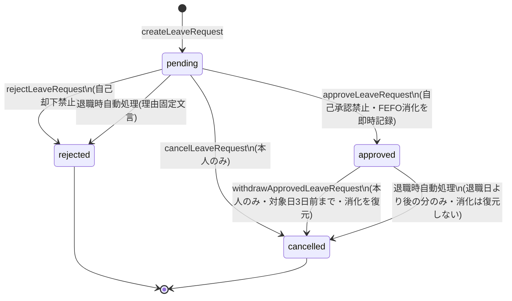

# 業務ロジック設計書

対応ファイル: `src/lib/leave/schedule.ts`, `balance.ts`, `request-rules.ts`, `mutations.ts`, `queries.ts`, `src/lib/employees/mutations.ts`。

いずれも spec.md 5〜7章(付与・失効・消化・申請ルール)およびセクション4.3/4.4(退職時処理)の実装である。`schedule.ts` / `balance.ts` / `request-rules.ts` はDBに依存しない純粋関数として切り出されており、業務ルールの正しさをユニットテストで検証しやすい構造になっている。

## 1. 有給付与スケジュール(`schedule.ts`)

spec.md 5.1 の法定付与日数テーブル(フルタイム・8割出勤要件を満たす前提)をそのままテーブル化している。

| 入社からの経過月数 | 付与日数 |
|---|---|
| 6ヶ月 | 10日 |
| 18ヶ月 | 11日 |
| 30ヶ月 | 12日 |
| 42ヶ月 | 14日 |
| 54ヶ月 | 16日 |
| 66ヶ月 | 18日 |
| 以降12ヶ月ごと | 20日(以降固定) |

`getNextGrantMilestone(hireDate, asOf)` は `hireDate` を基準に、`asOf` 以降で最初に到来する付与基準日を返す(社員一覧・詳細画面の「次回有給付与年月」表示に使用)。`MAX_MILESTONE_LOOKUPS = 1000` は無限ループ防止のための安全弁で、実運用上到達することはない。

**失効予定日(`computeExpireDate`)**: spec.md 5.2 の「利用可能な最終日 = 付与日から2年後の前日」をそのまま実装(`addYearsUTC(grantedDate, 2)` の1日前)。日付演算はすべて `src/lib/date/calendar.ts` のUTCベース関数(`addMonthsUTC`/`addYearsUTC`/`addDaysUTC`)を使い、タイムゾーンに起因するズレを防いでいる。

> **未実装**: この付与スケジュールに基づいて `LeaveGrant` レコードを実際に生成するバッチ処理・スケジュールジョブは存在しない。現状は `prisma/seed.ts` が `getNextGrantMilestone` を使って手動でシードしているのみ(`doc/00-overview.md` 参照)。

## 2. 残高計算とFEFO消化(`balance.ts`)

- `isGrantActive(expireDate, asOf)` — `expireDate >= asOf` であれば有効。
- `sortFefo(grants)` — spec.md 5.2 の消化順(**F**irst-**E**xpired-**F**irst-**O**ut)を実装。ソートキーは「失効日 昇順 → 付与日 昇順 → ID 昇順」の3段階(同日失効・同日付与の場合でも決定的な順序になるようIDで最終タイブレークする)。
- `sumRemaining(activeGrants)` — 有効な付与枠の残日数(`grantedDays - 消化済み合計`)を合算。社員一覧・詳細画面の「有給残日数」表示に使用。
- `planFefoConsumption(activeGrants, requiredDays)` — FEFO順に必要日数を按分した消化プランを返す。**残高が不足する場合は `InsufficientBalanceError` を投げ、呼び出し元のトランザクション全体をロールバックする**(承認処理は「全部消化できるか」を事前計算してから初めてDBへ書き込む設計)。

```mermaid
flowchart LR
    A[有効な付与枠を取得<br/>expireDate >= 今日] --> B[sortFefo で並び替え]
    B --> C{必要日数が残っているか}
    C -- Yes --> D[枠から min(残日数, 必要日数) を消化]
    D --> C
    C -- No --> E[消化プラン確定]
    C -- 全枠を見ても不足 --> F[InsufficientBalanceError]
```

## 3. 申請ルール(`request-rules.ts`)

- `checkNewRequest(existingActiveUnitsOnSameDate, newUnit)` — spec.md 4.3/6章の「同一日・同一区分の重複申請禁止」「同一日の合計申請日数が1.0日を超える申請の禁止」を判定する純粋関数。`existingActiveUnitsOnSameDate` は同一ユーザー・同一対象日で `pending`/`approved` の既存申請の `unit` 一覧。
  - 同じ `unit` が既に存在 → `duplicate_unit`
  - 合計が1.0日を超える(例: `am_half` 済みの日に `full_day` を申請) → `exceeds_daily_limit`
- `isWithinWithdrawalWindow(targetDate, asOf)` — 承認済み申請の自己取り下げ可能期限(**対象日の3日前まで**)を判定。`WITHDRAWAL_MIN_DAYS_BEFORE_TARGET = 3` として定数化されている(spec.md には明記されていない、実装側で採用した運用ルール)。

## 4. 有給申請の状態遷移(`mutations.ts` の `LeaveRequest.status`)



各操作の要点:

| 操作 | 関数 | 権限 | 備考 |
|---|---|---|---|
| 申請 | `createLeaveRequest` | 本人 | `pg_advisory_xact_lock(hashtext(userId), 対象日)` で同一ユーザー・同一日の同時申請を直列化してからルールチェック |
| 承認 | `approveLeaveRequest` | 管理者(申請者本人は不可) | 有効な付与枠を取得→FEFOで消化プランを算出→`LeaveConsumption` を即時作成。残高不足なら `InsufficientBalanceError` |
| 却下 | `rejectLeaveRequest` | 管理者(申請者本人は不可) | 残高に影響なし。理由は任意入力 |
| 取消(申請中のみ) | `cancelLeaveRequest` | 本人のみ | `pending` のみ対象 |
| 取り下げ(承認済み) | `withdrawApprovedLeaveRequest` | 本人のみ | 対象日の3日前を過ぎると不可(`isWithinWithdrawalWindow`)。まだ休暇取得前のため `LeaveConsumption.cancelledAt` をセットして残高を復元する |

## 5. 退職時自動処理(`src/lib/employees/mutations.ts` の `terminateEmployee`)

spec.md 4.3/4.4/9章に対応。管理者が退職日を指定すると、1つのトランザクションで以下を行う。

1. `User.status` を `terminated`、`terminationDate` を設定(自分自身は退職処理不可 = `CannotTerminateSelfError`)。
2. その社員の `pending` な申請をすべて `rejected` に自動却下(理由固定文言「退職処理による自動却下」)。
3. その社員の `approved` な申請のうち、**対象日が退職日より後のもの**をすべて `cancelled` に自動取消(`cancelledBy: "system"`、理由固定文言「退職処理による自動取消」)。

ここが自己取下げ(4章)との重要な違いで、**`LeaveConsumption` には一切触れず、消化済み日数の残高への復元は行わない**(spec.md 6/9章の仕様どおり)。退職済み社員の残高計算(`getActiveGrantsWithRemaining` 等)は `asOf` を退職日までに制限するのではなく、通常どおり `expireDate >= 今日` で有効判定するため、退職後も付与の失効自体は進行する(ただし新規付与は発生しない = `nextGrantYearMonth` は退職者には計算されない、`getEmployeeSummaries`/`getEmployeeDetail` 参照)。
